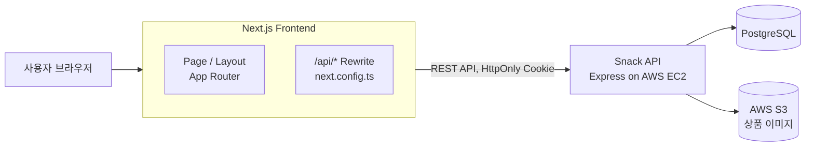
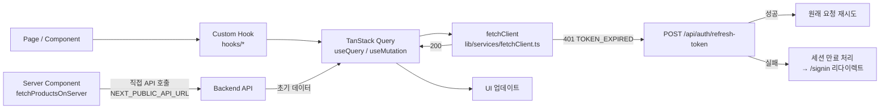
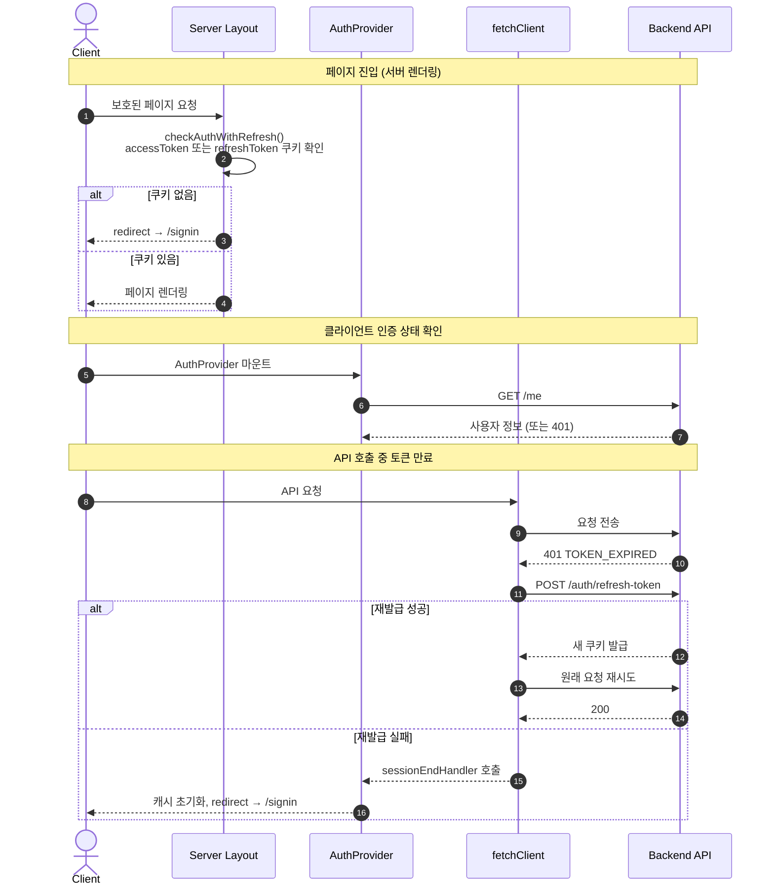
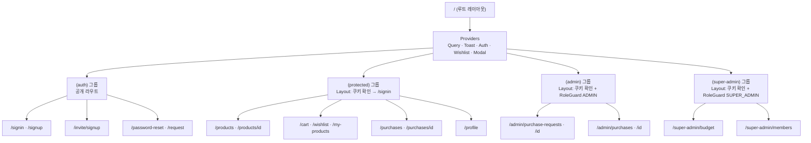

<div align="center">

# SNACK 🍪 Frontend

### 사내 간식 구매부터 관리까지, 한 곳에서.

여러 플랫폼에 흩어진 간식 구매 내역을  
효율적으로 관리하기 위한 **원스톱 간식 구매 관리 서비스**의 클라이언트

<br />

🚧 **현재 서비스 개발 및 README 문서화 진행 중입니다.**

<br />

`Next.js` · `TypeScript` · `TanStack Query` · `Tailwind CSS` · `Zod`

</div>

---

## 💡 Key Features

- 🔐 로그인 / 회원가입 / 초대 회원가입 / 비밀번호 재설정
- 🛒 상품 목록 · 상세 · 장바구니 · 위시리스트
- 📝 구매 요청 및 내역 조회 · 취소
- ✅ 구매 요청 승인 · 반려 (관리자)
- 💰 예산 현황 조회 및 설정 (최고 관리자)
- 👥 회원 초대 및 관리 (최고 관리자)
- 🗂 내가 등록한 상품 관리
- 👤 프로필 · 비밀번호 · 회사명 수정

## 🛠 Tech Stack

| 구분           | 사용 기술                                                    |
| -------------- | ------------------------------------------------------------ |
| Runtime        | Node.js, TypeScript                                          |
| Framework      | Next.js 16 (App Router)                                      |
| Language       | TypeScript 5                                                 |
| Styling        | Tailwind CSS 4, clsx, tailwind-merge                         |
| Server State   | TanStack Query 5                                             |
| Form           | React Hook Form, @hookform/resolvers                         |
| Validation     | Zod 4                                                        |
| Optimization   | React Compiler (babel-plugin-react-compiler)                 |
| 기타           | nanoid, Husky, Commitlint, Prettier, ESLint                  |

## 🏗 Architecture

### System Overview



Next.js의 `rewrites`를 이용해 `/api/*` 경로를 백엔드 서버로 프록시합니다.  
브라우저는 동일 출처(same-origin)로 요청하며, 쿠키는 `credentials: 'same-origin'`으로 자동 전달됩니다.

### Frontend Request / Rendering Flow



상품 목록 첫 페이지는 서버 컴포넌트에서 미리 패치해 TanStack Query 캐시에 주입합니다.  
이후 페이지네이션과 필터는 클라이언트에서 TanStack Query로 처리합니다.

### Project Structure

```text
src
├── app/                   # App Router — 라우트, 레이아웃, 페이지
│   ├── (auth)/            # 비로그인 공개 페이지 (signin, signup, password-reset, invite)
│   ├── (protected)/       # 로그인 필요 페이지 (products, cart, wishlist, purchases, profile)
│   ├── (admin)/           # ADMIN 이상 전용 (purchase-requests 승인·반려, purchases 조회)
│   ├── (super-admin)/     # SUPER_ADMIN 전용 (budget 설정, members 관리)
│   ├── providers.tsx      # 전역 Provider 트리 구성
│   └── layout.tsx         # 루트 레이아웃 (폰트, 전역 CSS)
├── components/
│   ├── auth/              # RoleGuard — 클라이언트 역할 보호 컴포넌트
│   ├── icons/             # SVG 아이콘 컴포넌트
│   └── ui/                # 재사용 공용 UI 컴포넌트 (Button, Modal, Toast, …)
├── hooks/                 # 도메인별 Custom Hook
│   ├── auth/              # 인증 훅
│   ├── cart/              # 장바구니 훅
│   ├── members/           # 회원 관리 훅
│   ├── products/          # 상품 훅
│   ├── purchase-requests/ # 구매 요청 훅
│   ├── purchases/         # 구매 내역 훅
│   ├── common/            # 공통 훅
│   └── wishlist/          # 위시리스트 훅
├── lib/
│   ├── auth/              # 서버 세션 확인 (session.ts), 비밀번호·Zod 스키마
│   └── services/          # API 서비스 레이어 (fetchClient, authService, productService, …)
├── providers/             # Context Provider (Auth, Query, Toast, Modal, Wishlist)
├── constants/             # UI 상수 (메뉴, 뱃지 등)
├── utils/                 # cn(), date, toKoreanWon, getErrorMessage 등
└── assets/                # 폰트, 아이콘, 이미지
```

팀 코딩 컨벤션은 [FE_CONVENTION.md](FE_CONVENTION.md)에 정리되어 있습니다.

## 🔐 Authentication & Authorization

서버가 발급한 **HttpOnly 쿠키**(accessToken · refreshToken)를 기반으로 인증합니다.



**서버 레이아웃 보호** — `(protected)`, `(admin)`, `(super-admin)` 그룹의 `layout.tsx`가 서버에서 쿠키를 확인하고 비인증 접근을 `/signin`으로 리다이렉트합니다.

**역할 보호 (클라이언트)** — `RoleGuard` 컴포넌트가 `AuthProvider`의 사용자 정보를 읽어 접근 권한을 검사합니다. 권한이 없으면 `/products` 또는 `/signin`으로 리다이렉트합니다.

**토큰 자동 재발급** — `fetchClient`는 `TOKEN_EXPIRED` 에러를 받으면 Refresh Token으로 재발급을 시도하고, 성공하면 원래 요청을 재시도합니다. 동시 요청이 있을 경우 재발급 요청은 하나만 실행됩니다(`refreshPromise` 공유).

| 역할          | 접근 가능 페이지                                                              |
| ------------- | ----------------------------------------------------------------------------- |
| `GENERAL`     | 상품 목록·상세, 장바구니, 위시리스트, 구매 요청·내역, 내 상품, 프로필        |
| `ADMIN`       | GENERAL 페이지 + 구매 요청 승인·반려, 구매 내역 조회                          |
| `SUPER_ADMIN` | ADMIN 페이지 + 예산 설정, 회원 초대·관리                                      |

## 📄 Page Overview

| Route                             | 대상          | 주요 기능                                      |
| --------------------------------- | ------------- | ---------------------------------------------- |
| `/`                               | 전체          | 랜딩 페이지                                    |
| `/signin`                         | 비로그인      | 이메일 · 비밀번호 로그인                       |
| `/signup`                         | 비로그인      | 기업 담당자(SUPER_ADMIN) 회원가입              |
| `/invite/signup`                  | 비로그인      | 초대 링크 기반 회원가입                        |
| `/password-reset/request`         | 비로그인      | 비밀번호 재설정 메일 요청                      |
| `/password-reset`                 | 비로그인      | 새 비밀번호 설정                               |
| `/products`                       | GENERAL 이상  | 상품 목록 (검색 · 카테고리 필터 · 정렬)        |
| `/products/[id]`                  | GENERAL 이상  | 상품 상세 · 장바구니 담기 · 위시리스트 추가    |
| `/cart`                           | GENERAL 이상  | 장바구니 목록 · 수량 변경 · 구매 요청 생성     |
| `/wishlist`                       | GENERAL 이상  | 위시리스트 목록                                |
| `/my-products`                    | GENERAL 이상  | 내가 등록한 상품 목록                          |
| `/purchases`                      | GENERAL 이상  | 내 구매 요청 내역 · 상태 확인 · 취소           |
| `/purchases/[id]`                 | GENERAL 이상  | 구매 요청 상세                                 |
| `/profile`                        | GENERAL 이상  | 프로필 조회 · 비밀번호 · 회사명 변경           |
| `/admin/purchase-requests`        | ADMIN 이상    | 조직 구매 요청 목록                            |
| `/admin/purchase-requests/[id]`   | ADMIN 이상    | 구매 요청 상세 · 승인 · 반려 (예산 확인 포함)  |
| `/admin/purchases`                | ADMIN 이상    | 처리된 구매 내역 조회                          |
| `/admin/purchases/[id]`           | ADMIN 이상    | 처리된 구매 상세                               |
| `/super-admin/budget`             | SUPER_ADMIN   | 이번 달 · 기본 예산 설정                       |
| `/super-admin/members`            | SUPER_ADMIN   | 회원 초대 · 검색 · 권한 변경 · 탈퇴 처리       |

## 🗺 Routing Structure



각 Route Group의 `layout.tsx`가 서버에서 쿠키를 검사해 비인증 요청을 차단합니다.  
역할 검사는 `RoleGuard` 클라이언트 컴포넌트가 추가로 담당합니다.

## 🚀 CI/CD & Deployment

현재 자동 배포 파이프라인은 구성되어 있지 않습니다.

| 단계              | 현재 상태 |
| ----------------- | --------- |
| 자동 빌드 · 배포  | 미구성    |
| 로컬 개발 서버    | `npm run dev` |

## ⚙️ Getting Started

```bash
cp .env.example .env   # 값 입력 후 진행
npm install
npm run dev            # 개발 서버, http://localhost:3000
```

| 명령                   | 설명                              |
| ---------------------- | --------------------------------- |
| `npm run dev`          | 개발 서버 실행                    |
| `npm run build`        | 프로덕션 빌드                     |
| `npm start`            | 프로덕션 서버 실행                |
| `npm run lint`         | ESLint 검사                       |
| `npm run type-check`   | TypeScript 타입 검사              |
| `npm test`             | Jest 테스트 실행                  |
| `npm run test:watch`   | Jest Watch 모드                   |

## 🔑 Environment Variables

실제 값은 저장소에 포함하지 않습니다. 형식은 [`.env.example`](.env.example)을 참고하세요.

| 변수                    | 용도                                                              |
| ----------------------- | ----------------------------------------------------------------- |
| `API_URL`               | 백엔드 API 서버 주소 — `next.config.ts`의 `/api/*` 리라이트 대상 |
| `NEXT_PUBLIC_API_URL`   | 서버 컴포넌트에서 상품 목록을 직접 패치할 때 사용                 |
